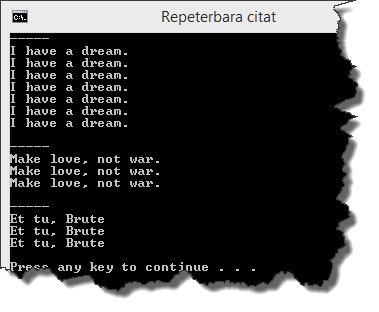
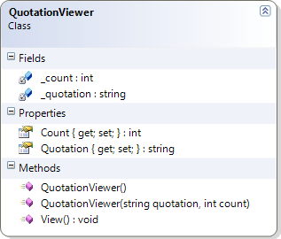

# Repeterbara citat

## Problem
I projektet som hör till övningsuppgiften skapas två objekt av klassen ```QuotationViewer``` i metoden ```Main```. Problemet är att klassen ```QuotationViewer``` saknas. Din uppgift är att skriva en klassdeklaration så att koden i ```Main```-metoden``` kan köras utan att förändras och utan problem. Programmet ska ge utskriften enligt bilden nedan.



Figur 1. Konsollutskrift efter att klassen QuotationViewer har implementerats korrekt.

Du får inte redigera koden i klassen ```Program``` på något sätt. All kod du skriver ska skrivas i klassdeklarationen till klassen ```QuotationViewer```. Genom att analysera Figur 1, klassdiagrammet och metoden ```Main``` ska du komma fram till hur klassen ska implementeras.


Figur 2. Klassdiagram över QuotationViewer.

```c#
using System;

namespace QuotationViewer
{
    class Program
    {
        static void Main(string[] args)
        {
            Console.Title = "Repeterbara citat";

            // Skapar ett nytt QuotationViewer-objekt med hjälp av 
            // standardkonstruktorn, använder egenskaper för att tilldela 
            // objektet värden och anropar en metod.
            QuotationViewer qw = new QuotationViewer();
            qw.Quotation = "I have a dream.";
            qw.Count = 7;
            qw.View();

            // Skapar och initierar ännu ett QuotationViewer-objekt med hjälp av 
            // konstruktorn som har två parametrar och anropar en metod.
            QuotationViewer anotherQw =
                new QuotationViewer("Make love, not war.", 3);
            anotherQw.View();

            // Ändrar på objektets data med hjälp av en egenskap och anropar en metod.
            anotherQw.Quotation = "Et tu, Brute";
            anotherQw.View();
        }
    }
}
```

Figur 3. Metoden Main som använder två QuotationViewer-objekt.

## Mål

Efter att ha gjort uppgiften ska du kunna:

- Implementera en klass genom att tolka ett klassdiagram och programkod som använder objekt som instansierats av klassen.
- Förstå vad ett fält (_field_) är och hur du deklarerar ett sådant.
- Skriva en standardkonstruktor och förstå vad konstruktorer har för roll.
- Förstå att en klass kan ha flera konstruktorer så länge de har olika parameterlistor. Kallas överlagring eller ”_overloading_”.
- Skriva egenskaper (_properties_).
- Kunna skriva en metod som inte returnerar något värde (_void_) och som inte har någon parameterlista.

## Tips

Läs om:

+ Klasser och fält
	+ Essential C# 6.0, 217-228.
	+ https://msdn.microsoft.com/en-us/library/0b0thckt.aspx
+ Konstruktorer
	+ Essential C# 6.0, 254-263.
	+ https://msdn.microsoft.com/en-us/library/ace5hbzh.aspx
+ Metoder
	+ Essential C# 6.0, 161-177.
	+ https://msdn.microsoft.com/en-us/library/ms173114.aspx
+ Egenskaper (_properties_)
	+ Essential C# 6.0, 237-244.
	+ https://msdn.microsoft.com/en-us/library/x9fsa0sw.aspx 

[Lösning](solution/README.md)
